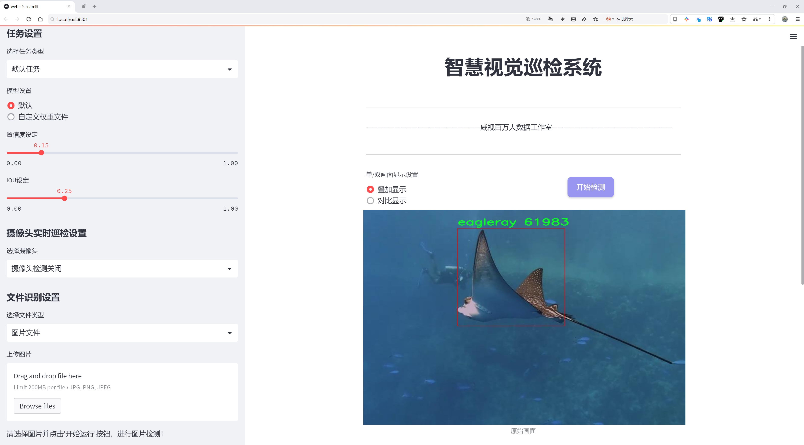
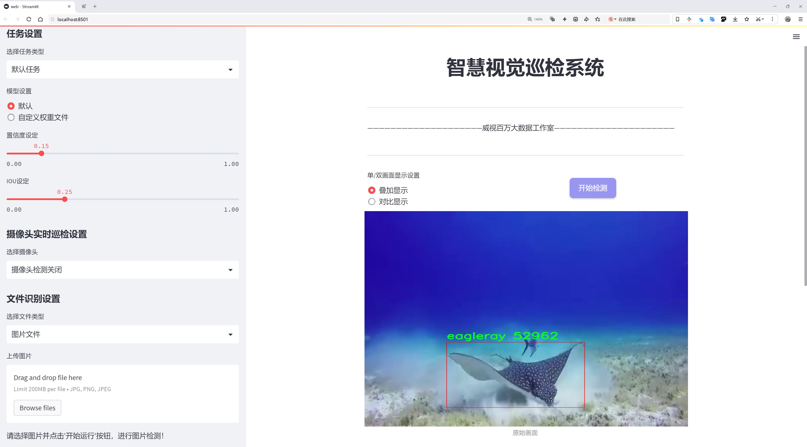
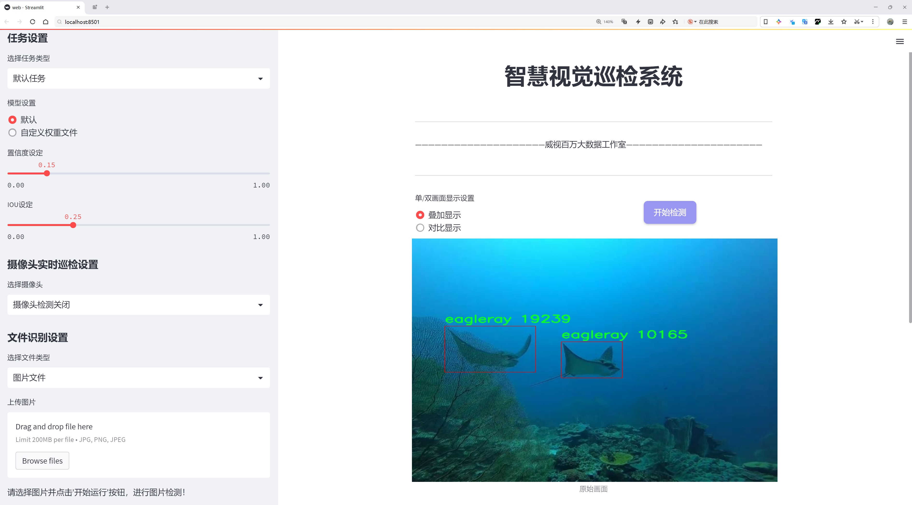
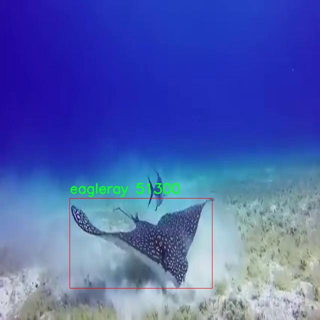
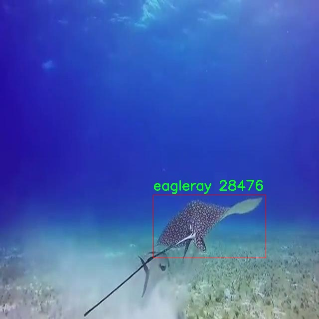
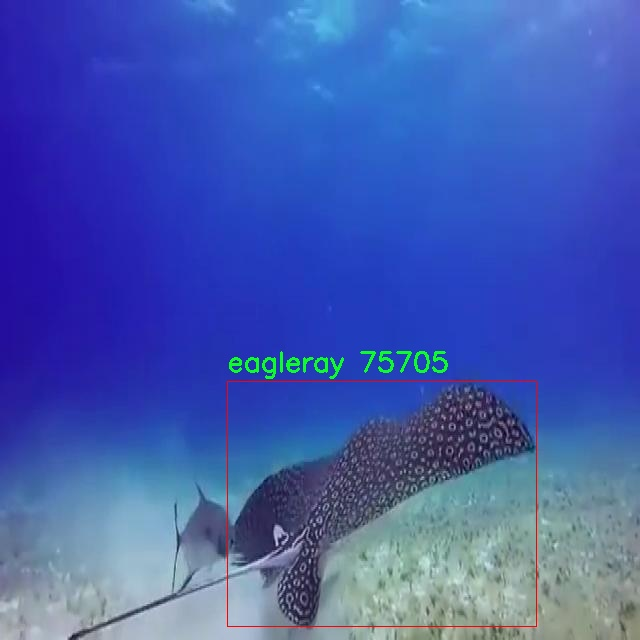
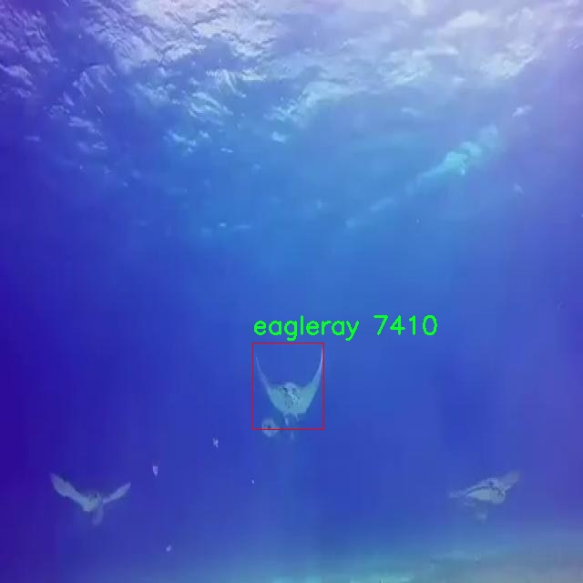
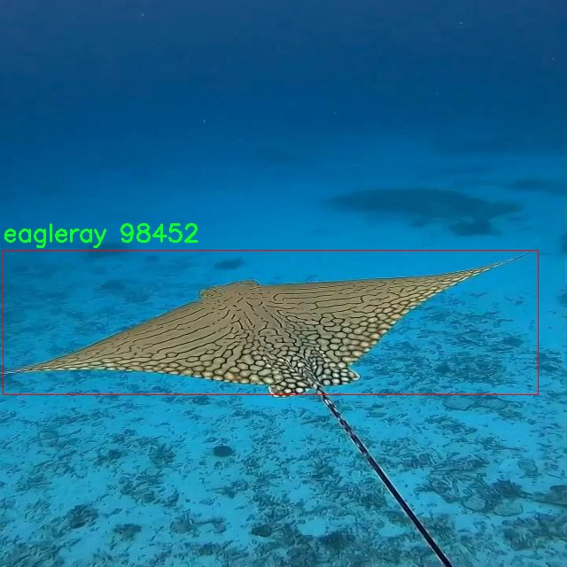

# 鹰鳐检测检测系统源码分享
 # [一条龙教学YOLOV8标注好的数据集一键训练_70+全套改进创新点发刊_Web前端展示]

### 1.研究背景与意义

项目参考[AAAI Association for the Advancement of Artificial Intelligence](https://gitee.com/qunshansj/projects)

项目来源[AACV Association for the Advancement of Computer Vision](https://gitee.com/qunmasj/projects)

研究背景与意义

随着生态环境的变化和人类活动的加剧，海洋生物的保护已成为全球关注的焦点之一。鹰鳐（Eagle Ray）作为一种重要的海洋生物，其独特的生态地位和美丽的外形使其成为研究海洋生态系统的重要对象。然而，鹰鳐的栖息地正面临着过度捕捞、海洋污染和气候变化等多重威胁，导致其种群数量逐渐减少。因此，建立高效的监测和保护机制显得尤为重要。近年来，计算机视觉技术的快速发展为生物监测提供了新的解决方案，尤其是基于深度学习的目标检测算法在物体识别和分类方面表现出色。

YOLO（You Only Look Once）系列算法以其实时性和高准确率在目标检测领域取得了显著的成果。YOLOv8作为该系列的最新版本，进一步优化了检测精度和速度，适用于多种复杂场景。然而，现有的YOLOv8模型在特定领域的应用仍存在一定的局限性，尤其是在针对特定物种的检测任务中。因此，基于改进YOLOv8的鹰鳐检测系统的研究，不仅能够提升鹰鳐的检测效率，还能为海洋生物的保护提供科学依据。

本研究将利用“EagleRay New”数据集，该数据集包含2500张鹰鳐的图像，涵盖了不同的拍摄角度和环境条件，具有较高的多样性和代表性。数据集中仅包含一个类别，即鹰鳐，这为模型的训练和优化提供了明确的目标。通过对该数据集的深入分析与处理，我们将针对YOLOv8进行改进，提升其在鹰鳐检测任务中的表现。具体而言，我们将采用数据增强技术，以扩展训练样本的多样性，并通过调整网络结构和超参数优化模型性能，从而提高鹰鳐的检测准确率和召回率。

研究的意义不仅体现在技术层面，更在于其对生态保护的推动作用。通过建立高效的鹰鳐检测系统，我们能够实现对鹰鳐种群的实时监测，及时获取其栖息地的变化信息。这为相关科研机构和保护组织提供了重要的数据支持，有助于制定更加科学合理的保护措施。此外，基于深度学习的目标检测技术的应用，能够为其他海洋生物的监测提供借鉴，推动整个海洋生态保护领域的技术进步。

综上所述，基于改进YOLOv8的鹰鳐检测系统的研究，既是对深度学习技术在生态监测领域应用的探索，也是对海洋生物保护工作的积极响应。通过本研究，我们希望能够为鹰鳐的保护与管理提供有效的技术支持，促进海洋生态环境的可持续发展。

### 2.图片演示







##### 注意：由于此博客编辑较早，上面“2.图片演示”和“3.视频演示”展示的系统图片或者视频可能为老版本，新版本在老版本的基础上升级如下：（实际效果以升级的新版本为准）

  （1）适配了YOLOV8的“目标检测”模型和“实例分割”模型，通过加载相应的权重（.pt）文件即可自适应加载模型。

  （2）支持“图片识别”、“视频识别”、“摄像头实时识别”三种识别模式。

  （3）支持“图片识别”、“视频识别”、“摄像头实时识别”三种识别结果保存导出，解决手动导出（容易卡顿出现爆内存）存在的问题，识别完自动保存结果并导出到tempDir中。

  （4）支持Web前端系统中的标题、背景图等自定义修改，后面提供修改教程。

  另外本项目提供训练的数据集和训练教程,暂不提供权重文件（best.pt）,需要您按照教程进行训练后实现图片演示和Web前端界面演示的效果。

### 3.视频演示

[3.1 视频演示](https://www.bilibili.com/video/BV1Rj4meDEoM/)

### 4.数据集信息展示

##### 4.1 本项目数据集详细数据（类别数＆类别名）

nc: 1
names: ['eagleray']


##### 4.2 本项目数据集信息介绍

数据集信息展示

在本研究中，我们采用了名为“EagleRay New”的数据集，以支持对改进YOLOv8模型的鹰鳐检测系统的训练和评估。该数据集专注于一种特定的海洋生物——鹰鳐，具有独特的形态特征和生态习性，因而在海洋生态监测和保护中具有重要的研究价值。数据集的设计旨在提供高质量的标注数据，以便于模型的学习和推理能力的提升。

“EagleRay New”数据集的类别数量为1，具体类别为“eagleray”。这一设计使得数据集在特定目标检测任务中具备高度的专一性，便于模型聚焦于鹰鳐的特征学习。数据集中包含了大量鹰鳐的图像，这些图像在不同的环境和条件下拍摄，涵盖了多种角度、光照和背景变化。这种多样性不仅增强了数据集的代表性，也为模型的泛化能力提供了良好的基础。

在数据采集过程中，研究团队通过多种手段获取鹰鳐的图像，包括潜水拍摄、遥感技术以及合作机构提供的图像资源。这些图像经过严格的筛选和标注，确保每一张图像中的鹰鳐都能被准确识别和定位。标注过程采用了专业的图像标注工具，确保了高质量的边界框标注和类别标签，进而为YOLOv8模型的训练提供了可靠的数据支持。

数据集的图像分辨率和质量也是其设计中的重要考虑因素。为了保证模型能够学习到鹰鳐的细微特征，数据集中包含了高分辨率的图像，这些图像能够清晰地展示鹰鳐的身体结构、颜色和纹理等信息。此外，数据集还考虑到了不同水域环境对鹰鳐外观的影响，例如在清澈水域和浑浊水域中，鹰鳐的可见度和表现可能有所不同，这种环境变化的考虑进一步丰富了数据集的多样性。

在数据集的使用过程中，我们将采用数据增强技术，以增加训练样本的多样性和数量。通过旋转、缩放、翻转和颜色变换等方法，我们可以有效扩展训练集，帮助模型更好地适应不同的视觉场景。这一过程不仅提升了模型的鲁棒性，也为其在实际应用中的表现奠定了基础。

总之，“EagleRay New”数据集为改进YOLOv8的鹰鳐检测系统提供了强有力的支持。通过高质量的图像和精确的标注，该数据集不仅促进了模型的训练和优化，也为后续的研究和应用提供了宝贵的资源。随着研究的深入，我们期待该数据集能够在海洋生物监测、生态保护等领域发挥更大的作用，为保护珍稀海洋生物贡献力量。











### 5.全套项目环境部署视频教程（零基础手把手教学）

[5.1 环境部署教程链接（零基础手把手教学）](https://www.ixigua.com/7404473917358506534?logTag=c807d0cbc21c0ef59de5)


[5.2 安装Python虚拟环境创建和依赖库安装视频教程链接（零基础手把手教学）](https://www.ixigua.com/7404474678003106304?logTag=1f1041108cd1f708b01a)

### 6.手把手YOLOV8训练视频教程（零基础小白有手就能学会）

[6.1 手把手YOLOV8训练视频教程（零基础小白有手就能学会）](https://www.ixigua.com/7404477157818401292?logTag=d31a2dfd1983c9668658)

### 7.70+种全套YOLOV8创新点代码加载调参视频教程（一键加载写好的改进模型的配置文件）

[7.1 70+种全套YOLOV8创新点代码加载调参视频教程（一键加载写好的改进模型的配置文件）](https://www.ixigua.com/7404478314661806627?logTag=29066f8288e3f4eea3a4)

### 8.70+种全套YOLOV8创新点原理讲解（非科班也可以轻松写刊发刊，V10版本正在科研待更新）

由于篇幅限制，每个创新点的具体原理讲解就不一一展开，具体见下列网址中的创新点对应子项目的技术原理博客网址【Blog】：


[8.1 70+种全套YOLOV8创新点原理讲解链接](https://gitee.com/qunmasj/good)

### 9.系统功能展示（检测对象为举例，实际内容以本项目数据集为准）

图9.1.系统支持检测结果表格显示

  图9.2.系统支持置信度和IOU阈值手动调节

  图9.3.系统支持自定义加载权重文件best.pt(需要你通过步骤5中训练获得)

  图9.4.系统支持摄像头实时识别

  图9.5.系统支持图片识别

  图9.6.系统支持视频识别

  图9.7.系统支持识别结果文件自动保存

  图9.8.系统支持Excel导出检测结果数据


### 10.原始YOLOV8算法原理

原始YOLOv8算法原理

YOLOv8算法作为目标检测领域的最新进展，承载着YOLO系列模型的演变与创新，展现了其在性能与灵活性上的显著提升。YOLOv8s模型的设计理念在于通过高效的特征提取与目标检测流程，推动计算机视觉技术的进一步发展。该模型的架构主要由三大部分构成：Backbone、Neck和Head，每一部分都在原有YOLO系列的基础上进行了优化与改进。

在特征提取阶段，YOLOv8s采用了CSPDarknet（Cross Stage Partial Darknet）作为其Backbone网络结构。CSPDarknet的设计思路是将网络划分为两个主要部分，每个部分都包含多个残差块，这种结构不仅提高了特征提取的效率，还增强了模型的表达能力。相较于前代的YOLOv5，YOLOv8s引入了C2f模块替代了C3模块，C2f模块的创新在于将输入特征图分为两个分支，每个分支经过卷积层进行降维处理，同时保留了更丰富的特征信息。每个v8_C2fBottleneck层的输出也被作为一个分支，这种多分支的设计使得特征图的维度得以提升，并通过后续的卷积层进行融合，最终形成一个更为高维的特征图。这种结构不仅加深了网络的深度，还促进了梯度流的有效传播，确保了模型在训练过程中的稳定性与收敛速度。

在特征提取的过程中，YOLOv8s还采用了快速空间金字塔池化（SPPF）结构，旨在提取不同尺度的特征。SPPF的引入有效减少了模型的参数量与计算量，同时提升了特征提取的效率，使得模型在处理多尺度目标时表现得更加出色。通过这种金字塔结构，YOLOv8s能够在不同的特征层次上捕捉到丰富的上下文信息，从而提高目标检测的准确性。

进入目标检测阶段，YOLOv8s采用了特征金字塔网络（FPN）与路径聚合网络（PAN）的结合，这一结构设计使得特征图的处理与压缩更加高效。通过多个卷积层与池化层的组合，YOLOv8s能够将提取到的特征图转换为最终的目标检测结果。与传统的锚框（Anchor）检测方法不同，YOLOv8s采用了一种基于无锚框的检测方式，直接预测目标的中心点及其宽高比例。这一创新显著减少了对Anchor框的依赖，进而提高了检测速度与准确度，使得模型在实际应用中更具灵活性。

在轻量化方面，YOLOv8n模型的设计同样值得关注。YOLOv8n在YOLOv5的基础上进行了进一步的优化，采用了更轻量化的C2F模块来替代原有的C3模块，调整了卷积的深度与尺寸，减少了网络的复杂性。特征融合层中，通过减少降采样层的数量并引入BiFPN网络，YOLOv8n实现了对不同尺度特征信息的快速提取。这种双向跨尺度连接的设计理念，结合加权特征融合的策略，使得YOLOv8n在保持高效性的同时，能够在不同的应用场景中展现出优异的性能。

总的来说，YOLOv8算法通过引入多种创新的网络结构与模块，提升了目标检测的准确性与速度。其高效的特征提取与目标检测方式，使得YOLOv8在处理复杂场景时表现得更加出色。无论是在实时视频监控、自动驾驶，还是在智能安防等领域，YOLOv8都展现出了强大的应用潜力与广泛的适用性。随着YOLOv8的不断发展与完善，未来的目标检测技术将会迎来更多的可能性与挑战，推动计算机视觉领域的持续进步。


### 11.项目核心源码讲解（再也不用担心看不懂代码逻辑）

#### 11.1 ui.py

以下是对代码的核心部分进行提炼和详细注释的版本：

```python
import sys
import subprocess

def run_script(script_path):
    """
    使用当前 Python 环境运行指定的脚本。

    Args:
        script_path (str): 要运行的脚本路径

    Returns:
        None
    """
    # 获取当前 Python 解释器的路径
    python_path = sys.executable

    # 构建运行命令，使用 streamlit 运行指定的脚本
    command = f'"{python_path}" -m streamlit run "{script_path}"'

    # 执行命令并等待其完成
    result = subprocess.run(command, shell=True)
    
    # 检查命令执行结果，如果返回码不为0，表示出错
    if result.returncode != 0:
        print("脚本运行出错。")

# 主程序入口
if __name__ == "__main__":
    # 指定要运行的脚本路径
    script_path = "web.py"  # 这里可以直接指定脚本名，假设它在当前目录

    # 调用函数运行脚本
    run_script(script_path)
```

### 代码分析与注释：

1. **导入模块**：
   - `sys`：用于访问与 Python 解释器紧密相关的变量和函数。
   - `subprocess`：用于创建新进程、连接到它们的输入/输出/错误管道，并获得它们的返回码。

2. **`run_script` 函数**：
   - **参数**：接收一个字符串类型的参数 `script_path`，表示要运行的 Python 脚本的路径。
   - **功能**：构建并执行一个命令来运行指定的脚本，使用当前 Python 环境的解释器。

3. **获取 Python 解释器路径**：
   - `sys.executable`：返回当前 Python 解释器的路径，确保使用的是当前环境的 Python。

4. **构建命令**：
   - 使用 `f-string` 格式化字符串，构建运行 `streamlit` 的命令。`-m streamlit run` 是用来运行 Streamlit 应用的标准命令。

5. **执行命令**：
   - `subprocess.run`：执行构建的命令，`shell=True` 允许在 shell 中执行命令。

6. **错误处理**：
   - 检查 `result.returncode`，如果不为0，表示命令执行失败，打印错误信息。

7. **主程序入口**：
   - `if __name__ == "__main__":`：确保只有在直接运行该脚本时才会执行以下代码。
   - 指定要运行的脚本路径为 `web.py`，然后调用 `run_script` 函数来执行该脚本。

通过以上分析和注释，可以清晰地理解代码的核心功能和结构。

这个文件名为 `ui.py`，其主要功能是运行一个指定的 Python 脚本，具体来说是通过 Streamlit 框架来启动一个 Web 应用。

首先，文件导入了几个必要的模块，包括 `sys`、`os` 和 `subprocess`。其中，`sys` 模块用于访问与 Python 解释器相关的变量和函数，`os` 模块提供了与操作系统交互的功能，而 `subprocess` 模块则用于生成新的进程、连接到它们的输入/输出/错误管道，并获取它们的返回码。

接下来，文件从 `QtFusion.path` 导入了 `abs_path` 函数，这个函数的作用是获取给定路径的绝对路径，确保后续操作中使用的是完整的文件路径。

在 `run_script` 函数中，首先定义了一个参数 `script_path`，它是要运行的脚本的路径。函数内部首先获取当前 Python 解释器的路径，这通过 `sys.executable` 实现。然后，构建一个命令字符串，使用 Streamlit 来运行指定的脚本。命令的格式是 `"{python_path}" -m streamlit run "{script_path}"`，其中 `{python_path}` 和 `{script_path}` 分别被当前 Python 解释器的路径和要运行的脚本路径替换。

接着，使用 `subprocess.run` 方法执行构建好的命令。这个方法会启动一个新的进程来运行命令，并等待其完成。运行结束后，通过检查 `result.returncode` 来判断脚本是否成功运行。如果返回码不为 0，表示运行过程中出现了错误，程序会打印出“脚本运行出错。”的提示信息。

最后，在文件的主程序部分，使用 `if __name__ == "__main__":` 语句来确保只有在直接运行该文件时才会执行下面的代码。这里指定了要运行的脚本路径为 `web.py`，并调用 `run_script` 函数来执行这个脚本。

总的来说，这个 `ui.py` 文件的作用是通过 Streamlit 框架启动一个 Web 应用，简化了脚本的运行过程，使得用户可以方便地启动指定的 Python 脚本。

#### 11.2 code\ultralytics\data\loaders.py

以下是代码中最核心的部分，并附上详细的中文注释：

```python
import cv2
import numpy as np
import torch
from pathlib import Path
from threading import Thread
from urllib.parse import urlparse

class LoadStreams:
    """
    视频流加载器，支持多种视频流输入源。
    适用于 `yolo predict source='rtsp://example.com/media.mp4'` 等命令。
    """

    def __init__(self, sources="file.streams", imgsz=640, vid_stride=1, buffer=False):
        """初始化加载器的参数和视频流源。"""
        torch.backends.cudnn.benchmark = True  # 加速固定大小推理
        self.buffer = buffer  # 是否缓冲输入流
        self.running = True  # 线程运行标志
        self.imgsz = imgsz  # 图像大小
        self.vid_stride = vid_stride  # 视频帧率步幅

        # 读取视频源，支持从文件或直接输入
        sources = Path(sources).read_text().rsplit() if os.path.isfile(sources) else [sources]
        n = len(sources)
        self.fps = [0] * n  # 每个流的帧率
        self.frames = [0] * n  # 每个流的总帧数
        self.threads = [None] * n  # 线程列表
        self.caps = [None] * n  # 视频捕获对象列表
        self.imgs = [[] for _ in range(n)]  # 存储每个流的图像
        self.shape = [[] for _ in range(n)]  # 存储每个流的图像形状
        self.sources = [x.strip() for x in sources]  # 清理源名称

        for i, s in enumerate(sources):  # 遍历每个源
            # 启动线程读取视频流的帧
            self.caps[i] = cv2.VideoCapture(s)  # 创建视频捕获对象
            if not self.caps[i].isOpened():
                raise ConnectionError(f"无法打开 {s}")
            w = int(self.caps[i].get(cv2.CAP_PROP_FRAME_WIDTH))  # 获取视频宽度
            h = int(self.caps[i].get(cv2.CAP_PROP_FRAME_HEIGHT))  # 获取视频高度
            fps = self.caps[i].get(cv2.CAP_PROP_FPS)  # 获取帧率
            self.frames[i] = max(int(self.caps[i].get(cv2.CAP_PROP_FRAME_COUNT)), 0) or float("inf")  # 总帧数
            self.fps[i] = max((fps if fps > 0 else 30), 0)  # 帧率，默认30

            success, im = self.caps[i].read()  # 读取第一帧
            if not success or im is None:
                raise ConnectionError(f"无法读取 {s} 的图像")
            self.imgs[i].append(im)  # 存储第一帧
            self.shape[i] = im.shape  # 存储图像形状
            self.threads[i] = Thread(target=self.update, args=([i, self.caps[i], s]), daemon=True)  # 启动线程
            self.threads[i].start()  # 启动线程

    def update(self, i, cap, stream):
        """在守护线程中读取视频流的帧。"""
        n = 0  # 帧计数
        while self.running and cap.isOpened():
            if len(self.imgs[i]) < 30:  # 保持缓冲区不超过30帧
                n += 1
                cap.grab()  # 抓取下一帧
                if n % self.vid_stride == 0:  # 根据步幅读取帧
                    success, im = cap.retrieve()  # 获取帧
                    if not success:
                        im = np.zeros(self.shape[i], dtype=np.uint8)  # 如果失败，返回空图像
                    if self.buffer:
                        self.imgs[i].append(im)  # 如果缓冲，添加到列表
                    else:
                        self.imgs[i] = [im]  # 否则只保留最新帧

    def close(self):
        """关闭流加载器并释放资源。"""
        self.running = False  # 停止线程
        for thread in self.threads:
            if thread.is_alive():
                thread.join(timeout=5)  # 等待线程结束
        for cap in self.caps:  # 释放视频捕获对象
            cap.release()
        cv2.destroyAllWindows()  # 关闭所有OpenCV窗口

    def __iter__(self):
        """返回迭代器对象。"""
        self.count = -1
        return self

    def __next__(self):
        """返回源路径、图像和元数据。"""
        self.count += 1
        images = []
        for i, x in enumerate(self.imgs):
            while not x:  # 等待帧可用
                if not self.threads[i].is_alive():
                    self.close()
                    raise StopIteration
                time.sleep(1 / min(self.fps))  # 等待
                x = self.imgs[i]

            images.append(x.pop(0))  # 获取并移除第一帧

        return self.sources, images, None, ""  # 返回源、图像和元数据

    def __len__(self):
        """返回源对象的长度。"""
        return len(self.sources)  # 返回源数量
```

### 代码核心部分说明：
1. **LoadStreams 类**：用于加载视频流，支持多种输入源（如 RTSP、RTMP、HTTP 等）。
2. **__init__ 方法**：初始化类的属性，设置视频源，创建视频捕获对象，并启动线程读取视频帧。
3. **update 方法**：在后台线程中持续读取视频帧，保持一定数量的帧在缓冲区。
4. **close 方法**：关闭视频流并释放资源。
5. **__iter__ 和 __next__ 方法**：实现迭代器接口，允许逐帧读取视频流。

以上代码是 YOLO 模型在处理视频流时的核心部分，确保能够实时读取和处理视频数据。

这个程序文件是Ultralytics YOLO（You Only Look Once）框架的一部分，主要负责加载不同类型的数据源，包括视频流、图像、屏幕截图和PyTorch张量。文件中定义了多个类，每个类负责处理特定类型的数据源。

首先，`SourceTypes`类用于表示不同的输入源类型，如网络摄像头、截图、图像文件和张量。这个类使用了Python的`dataclass`装饰器，简化了属性的定义。

接下来是`LoadStreams`类，它用于加载各种视频流，支持RTSP、RTMP、HTTP和TCP流。这个类的构造函数接受源路径、图像大小、视频帧率步幅和缓冲选项。它会尝试打开每个视频流，并在后台线程中读取帧。类中定义了多个方法，包括`update`（在后台线程中读取流帧）、`close`（关闭流并释放资源）、`__iter__`和`__next__`（用于迭代流中的帧）。

`LoadScreenshots`类用于加载屏幕截图，支持实时捕获。它使用`mss`库进行屏幕捕获，并提供了迭代器方法以便逐帧返回捕获的图像。

`LoadImages`类则用于加载图像和视频文件。它支持从单个图像文件、视频文件或图像和视频路径列表中加载数据。该类的构造函数会检查文件的存在性，并根据文件类型设置标志。它同样实现了迭代器方法以便逐帧返回图像或视频帧。

`LoadPilAndNumpy`类用于从PIL和Numpy数组加载图像，确保图像格式正确并进行必要的转换。它的设计目的是支持批处理。

`LoadTensor`类用于从PyTorch张量加载图像数据，确保输入张量的格式正确，并提供迭代器方法以便逐帧返回图像。

文件的最后部分定义了一个`autocast_list`函数，用于将不同类型的源合并为Numpy数组或PIL图像的列表。还有一个`get_best_youtube_url`函数，用于从给定的YouTube视频中提取最佳质量的MP4视频流URL。

整体来看，这个文件的主要功能是为YOLO模型提供灵活的数据加载机制，支持多种输入源，便于进行目标检测任务。

#### 11.3 code\ultralytics\data\annotator.py

以下是代码中最核心的部分，并附上详细的中文注释：

```python
from pathlib import Path
from ultralytics import SAM, YOLO

def auto_annotate(data, det_model="yolov8x.pt", sam_model="sam_b.pt", device="", output_dir=None):
    """
    自动标注图像，使用YOLO目标检测模型和SAM分割模型。

    参数:
        data (str): 包含待标注图像的文件夹路径。
        det_model (str, optional): 预训练的YOLO检测模型，默认为'yolov8x.pt'。
        sam_model (str, optional): 预训练的SAM分割模型，默认为'sam_b.pt'。
        device (str, optional): 运行模型的设备，默认为空字符串（CPU或可用的GPU）。
        output_dir (str | None | optional): 保存标注结果的目录。
            默认为与'data'相同目录下的'labels'文件夹。

    示例:
        auto_annotate(data='ultralytics/assets', det_model='yolov8n.pt', sam_model='mobile_sam.pt')
    """
    # 加载YOLO目标检测模型
    det_model = YOLO(det_model)
    # 加载SAM分割模型
    sam_model = SAM(sam_model)

    # 将数据路径转换为Path对象
    data = Path(data)
    # 如果未指定输出目录，则创建一个默认的输出目录
    if not output_dir:
        output_dir = data.parent / f"{data.stem}_auto_annotate_labels"
    # 创建输出目录（如果不存在）
    Path(output_dir).mkdir(exist_ok=True, parents=True)

    # 使用YOLO模型对数据进行检测，stream=True表示实时流处理
    det_results = det_model(data, stream=True, device=device)

    # 遍历检测结果
    for result in det_results:
        # 获取检测到的类别ID
        class_ids = result.boxes.cls.int().tolist()  # noqa
        # 如果检测到的类别ID不为空
        if len(class_ids):
            # 获取边界框的坐标
            boxes = result.boxes.xyxy  # 边界框输出对象
            # 使用SAM模型进行分割，传入原始图像和边界框
            sam_results = sam_model(result.orig_img, bboxes=boxes, verbose=False, save=False, device=device)
            # 获取分割结果的掩码
            segments = sam_results[0].masks.xyn  # noqa

            # 将分割结果写入文本文件
            with open(f"{Path(output_dir) / Path(result.path).stem}.txt", "w") as f:
                for i in range(len(segments)):
                    s = segments[i]
                    # 如果分割结果为空，则跳过
                    if len(s) == 0:
                        continue
                    # 将分割结果转换为字符串并写入文件
                    segment = map(str, segments[i].reshape(-1).tolist())
                    f.write(f"{class_ids[i]} " + " ".join(segment) + "\n")
```

### 代码说明：
1. **模型加载**：首先加载YOLO和SAM模型，用于目标检测和图像分割。
2. **路径处理**：使用`Path`类处理输入数据的路径，并创建输出目录。
3. **目标检测**：通过YOLO模型对输入图像进行检测，获取检测结果。
4. **图像分割**：对于每个检测结果，使用SAM模型进行图像分割，得到分割掩码。
5. **结果保存**：将分割结果和对应的类别ID写入文本文件，以便后续使用。

这个程序文件是用于自动标注图像的，主要依赖于YOLO（You Only Look Once）目标检测模型和SAM（Segment Anything Model）分割模型。其核心功能是对指定文件夹中的图像进行处理，自动生成标注信息，并将结果保存到指定的输出目录。

程序首先导入了必要的库，包括`Path`用于处理文件路径，以及`SAM`和`YOLO`这两个模型类。接着定义了一个名为`auto_annotate`的函数，该函数接受多个参数。`data`参数是一个字符串，表示包含待标注图像的文件夹路径。`det_model`和`sam_model`分别是YOLO和SAM的预训练模型的文件名，默认值分别为'yolov8x.pt'和'sam_b.pt'。`device`参数用于指定运行模型的设备，可以是CPU或GPU，默认为空字符串。`output_dir`参数用于指定保存标注结果的目录，如果未提供，则默认在`data`目录下创建一个名为“_auto_annotate_labels”的文件夹。

在函数内部，首先加载YOLO和SAM模型。接着将`data`转换为`Path`对象，以便于后续的路径操作。如果未指定输出目录，则根据输入数据的路径创建一个新的输出目录。接下来，使用YOLO模型对图像进行目标检测，结果以流的形式返回。

对于每个检测结果，程序提取出类别ID和边界框信息。如果检测到的类别ID不为空，则继续使用SAM模型对原始图像进行分割，传入检测到的边界框。分割结果中的掩码信息被提取出来。最后，程序将每个图像的标注信息写入到一个文本文件中，文件名与原始图像相同，内容包括类别ID和相应的分割坐标。

总的来说，这段代码实现了一个自动化的图像标注流程，通过结合目标检测和图像分割技术，能够高效地生成图像的标注数据，方便后续的模型训练或评估。

#### 11.4 code\ultralytics\utils\downloads.py

以下是代码中最核心的部分，并附上详细的中文注释：

```python
import requests
from pathlib import Path
from zipfile import ZipFile, is_zipfile
from ultralytics.utils import LOGGER, TQDM

def safe_download(
    url,
    file=None,
    dir=None,
    unzip=True,
    delete=False,
    retry=3,
    min_bytes=1e0,
    exist_ok=False,
    progress=True,
):
    """
    从指定的 URL 下载文件，并提供重试、解压和删除下载文件的选项。

    参数:
        url (str): 要下载的文件的 URL。
        file (str, optional): 下载文件的文件名。如果未提供，将使用 URL 的名称。
        dir (str, optional): 保存下载文件的目录。如果未提供，将保存在当前工作目录中。
        unzip (bool, optional): 是否在下载后解压文件。默认值为 True。
        delete (bool, optional): 是否在解压后删除下载的文件。默认值为 False。
        retry (int, optional): 下载失败时重试的次数。默认值为 3。
        min_bytes (float, optional): 下载文件成功的最小字节数。默认值为 1E0。
        exist_ok (bool, optional): 解压时是否覆盖现有内容。默认值为 False。
        progress (bool, optional): 下载过程中是否显示进度条。默认值为 True。

    返回:
        (Path): 解压后的目录路径。
    """
    f = Path(dir or ".") / (file or url2file(url))  # 生成下载文件的完整路径
    if not f.is_file():  # 如果文件不存在
        desc = f"Downloading {url} to '{f}'"
        LOGGER.info(f"{desc}...")
        f.parent.mkdir(parents=True, exist_ok=True)  # 创建目录
        for i in range(retry + 1):
            try:
                # 使用 requests 下载文件
                with requests.get(url, stream=True) as response:
                    response.raise_for_status()  # 检查请求是否成功
                    with open(f, "wb") as f_opened:
                        for data in response.iter_content(chunk_size=8192):
                            f_opened.write(data)  # 写入文件
                if f.exists() and f.stat().st_size > min_bytes:
                    break  # 下载成功
            except Exception as e:
                if i >= retry:
                    raise ConnectionError(f"❌  Download failure for {url}. Retry limit reached.") from e
                LOGGER.warning(f"⚠️ Download failure, retrying {i + 1}/{retry} {url}...")

    # 解压文件
    if unzip and f.exists() and f.suffix in (".zip", ".tar", ".gz"):
        unzip_dir = dir or f.parent  # 解压目录
        if is_zipfile(f):
            with ZipFile(f) as zipObj:
                zipObj.extractall(unzip_dir)  # 解压所有文件
        if delete:
            f.unlink()  # 删除 zip 文件
        return unzip_dir  # 返回解压后的目录
```

### 代码核心部分解释：
1. **safe_download 函数**：这是一个核心函数，用于从指定的 URL 下载文件。它支持重试机制、解压缩和删除下载的文件。
2. **参数说明**：
   - `url`：要下载的文件的 URL。
   - `file`：下载后保存的文件名。
   - `dir`：下载文件的保存目录。
   - `unzip`：下载后是否解压文件。
   - `delete`：解压后是否删除原始压缩文件。
   - `retry`：下载失败时的重试次数。
   - `min_bytes`：成功下载的文件最小字节数。
   - `exist_ok`：解压时是否覆盖现有文件。
   - `progress`：下载时是否显示进度条。
3. **下载过程**：
   - 生成下载文件的完整路径，如果文件不存在，则开始下载。
   - 使用 `requests` 库下载文件，并在下载过程中写入文件。
   - 检查下载的文件大小是否符合要求。
4. **解压过程**：
   - 如果下载的文件是压缩文件，则解压到指定目录。
   - 根据 `delete` 参数决定是否删除原始压缩文件。

这段代码的核心功能是确保文件能够从网络上可靠地下载，并在需要时进行解压缩和清理。

这个程序文件 `downloads.py` 是 Ultralytics YOLO 项目的一部分，主要用于处理文件的下载、解压和相关的文件管理操作。文件中包含了多个函数，每个函数都有特定的功能，下面是对这些功能的详细说明。

首先，文件引入了一些必要的库，包括处理文件路径的 `Path`、网络请求的 `requests`、以及用于多线程下载的 `ThreadPool`。同时，定义了一些常量，如 GitHub 资源库的名称和可下载的模型文件列表。

`is_url` 函数用于验证给定字符串是否为有效的 URL，并可选择性地检查该 URL 是否在线。它通过解析 URL 并尝试访问来确认其有效性。

`delete_dsstore` 函数用于删除指定目录下的 `.DS_Store` 文件，这些文件是 macOS 系统生成的隐藏文件，可能在不同操作系统之间传输文件时造成问题。

`zip_directory` 函数用于将指定目录的内容压缩为 ZIP 文件，并排除特定的文件（如 `.DS_Store`）。它支持显示压缩进度条，并返回生成的 ZIP 文件路径。

`unzip_file` 函数用于解压缩 ZIP 文件到指定路径，并排除特定的文件。它会根据 ZIP 文件的结构决定解压的目标目录，并提供进度条显示。

`check_disk_space` 函数用于检查下载文件所需的磁盘空间是否足够。它会获取文件的大小并与当前可用的磁盘空间进行比较，如果空间不足，可以选择抛出错误或仅发出警告。

`get_google_drive_file_info` 函数用于从 Google Drive 的分享链接中提取直接下载链接和文件名。它会处理下载配额超限的情况，并返回有效的下载链接。

`safe_download` 函数是核心下载功能，支持从 URL 下载文件，并可选择解压、删除原文件、重试下载等。它还可以处理 Google Drive 的链接，并确保下载的文件符合大小要求。

`get_github_assets` 函数用于从指定的 GitHub 仓库获取版本标签和资源列表，支持获取最新版本的资源。

`attempt_download_asset` 函数尝试从 GitHub 下载指定的文件，如果本地不存在该文件，则会进行下载。它会检查文件是否已经存在，并根据需要调用 `safe_download` 进行下载。

最后，`download` 函数支持从一个或多个 URL 下载文件，支持并发下载。它会创建目标目录，并根据参数决定是否解压和删除 ZIP 文件。

整体而言，这个文件提供了一系列实用的工具函数，方便用户在使用 Ultralytics YOLO 时进行模型和数据的下载与管理。

#### 11.5 70+种YOLOv8算法改进源码大全和调试加载训练教程（非必要）\ultralytics\utils\tuner.py

以下是经过简化和注释的核心代码部分：

```python
import subprocess
from ultralytics.utils import LOGGER, NUM_THREADS
from ray import tune
from ray.air import RunConfig
from ray.tune.schedulers import ASHAScheduler

def run_ray_tune(model, space: dict = None, grace_period: int = 10, gpu_per_trial: int = None, max_samples: int = 10, **train_args):
    """
    使用 Ray Tune 进行超参数调优。

    参数:
        model (YOLO): 要调优的模型。
        space (dict, optional): 超参数搜索空间，默认为 None。
        grace_period (int, optional): ASHA 调度器的宽限期（以 epoch 为单位），默认为 10。
        gpu_per_trial (int, optional): 每个试验分配的 GPU 数量，默认为 None。
        max_samples (int, optional): 最大试验次数，默认为 10。
        train_args (dict, optional): 传递给 `train()` 方法的附加参数，默认为 {}。

    返回:
        (dict): 包含超参数搜索结果的字典。
    """

    # 安装 Ray Tune
    subprocess.run('pip install ray[tune]'.split(), check=True)

    # 定义默认的超参数搜索空间
    default_space = {
        'lr0': tune.uniform(1e-5, 1e-1),  # 初始学习率
        'lrf': tune.uniform(0.01, 1.0),   # 最终学习率
        'momentum': tune.uniform(0.6, 0.98),  # 动量
        'weight_decay': tune.uniform(0.0, 0.001),  # 权重衰减
        # 其他超参数...
    }

    # 将模型放入 Ray 存储中
    model_in_store = ray.put(model)

    def _tune(config):
        """
        使用指定的超参数和附加参数训练 YOLO 模型。

        参数:
            config (dict): 用于训练的超参数字典。

        返回:
            None.
        """
        model_to_train = ray.get(model_in_store)  # 从 Ray 存储中获取模型
        model_to_train.reset_callbacks()  # 重置回调
        config.update(train_args)  # 更新训练参数
        results = model_to_train.train(**config)  # 训练模型
        return results.results_dict  # 返回结果字典

    # 获取搜索空间
    if not space:
        space = default_space  # 如果没有提供搜索空间，则使用默认值

    # 定义可训练函数并分配资源
    trainable_with_resources = tune.with_resources(_tune, {'cpu': NUM_THREADS, 'gpu': gpu_per_trial or 0})

    # 定义 ASHA 调度器
    asha_scheduler = ASHAScheduler(time_attr='epoch', metric='metric_name', mode='max', max_t=100, grace_period=grace_period)

    # 创建 Ray Tune 超参数搜索调优器
    tuner = tune.Tuner(trainable_with_resources, param_space=space, tune_config=tune.TuneConfig(scheduler=asha_scheduler, num_samples=max_samples), run_config=RunConfig())

    # 运行超参数搜索
    tuner.fit()

    # 返回超参数搜索的结果
    return tuner.get_results()
```

### 代码说明：
1. **导入必要的库**：导入 `subprocess` 用于安装依赖，导入 `ray` 和 `tune` 进行超参数调优。
2. **定义 `run_ray_tune` 函数**：该函数用于执行超参数调优，接受模型和多个参数。
3. **安装 Ray Tune**：通过 `subprocess.run` 安装 Ray Tune 库。
4. **定义默认超参数空间**：设置一组默认的超参数范围供调优使用。
5. **模型存储**：将模型放入 Ray 的存储中，以便在调优过程中使用。
6. **定义 `_tune` 函数**：这是实际训练模型的函数，使用传入的超参数进行训练。
7. **获取搜索空间**：如果用户没有提供搜索空间，则使用默认的超参数空间。
8. **定义可训练函数**：使用 `tune.with_resources` 定义可以使用的资源（CPU 和 GPU）。
9. **定义 ASHA 调度器**：设置调度器以管理超参数搜索过程。
10. **创建调优器并运行**：使用 `tune.Tuner` 创建调优器并执行超参数搜索，最后返回结果。

这个程序文件是一个用于YOLOv8模型超参数调优的工具，利用了Ray Tune库来实现高效的超参数搜索。程序首先导入了必要的模块和库，包括用于配置和日志记录的工具，以及Ray Tune的相关功能。

在`run_ray_tune`函数中，用户可以传入一个YOLO模型以及一些超参数搜索的配置选项。函数的参数包括模型对象、超参数搜索空间、训练过程中的宽限期、每个试验分配的GPU数量、最大样本数等。函数的返回值是一个字典，包含超参数搜索的结果。

函数开始时，首先记录了一条信息，指向Ray Tune的文档。接着，它尝试安装Ray Tune库，如果安装失败，则抛出一个模块未找到的错误。随后，程序会检查是否安装了Wandb（一个用于实验跟踪的工具），并确保其版本可用。

接下来，定义了一个默认的超参数搜索空间，包括学习率、动量、权重衰减、数据增强参数等。然后，程序将模型放入Ray的存储中，以便在调优过程中使用。

`_tune`函数是实际进行模型训练的地方，它接收一个包含超参数的配置字典，并使用这些参数来训练模型。训练完成后，返回训练结果的字典。

在获取搜索空间时，如果用户没有提供自定义的搜索空间，则使用默认的搜索空间。同时，程序还会从训练参数中获取数据集的信息，如果没有提供数据集，则使用默认值。

接下来，定义了一个可分配资源的可训练函数，并设置了ASHA调度器来管理超参数搜索的过程。ASHA调度器根据训练过程中的性能指标来决定哪些试验应该继续进行，哪些应该提前终止。

然后，程序设置了用于超参数搜索的回调函数，主要是Wandb的日志记录功能（如果可用）。最后，创建了Ray Tune的调优器，并运行超参数搜索。

在搜索完成后，函数返回调优的结果，供用户分析和使用。整个程序的设计旨在简化YOLOv8模型的超参数调优过程，提高模型训练的效率和效果。

#### 11.6 train.py

以下是代码中最核心的部分，并附上详细的中文注释：

```python
class DetectionTrainer(BaseTrainer):
    """
    DetectionTrainer类，继承自BaseTrainer类，用于基于检测模型的训练。
    """

    def build_dataset(self, img_path, mode="train", batch=None):
        """
        构建YOLO数据集。

        参数:
            img_path (str): 包含图像的文件夹路径。
            mode (str): 模式，`train`表示训练模式，`val`表示验证模式，用户可以为每种模式自定义不同的增强。
            batch (int, optional): 批次大小，仅用于`rect`模式。默认为None。
        """
        gs = max(int(de_parallel(self.model).stride.max() if self.model else 0), 32)
        return build_yolo_dataset(self.args, img_path, batch, self.data, mode=mode, rect=mode == "val", stride=gs)

    def get_dataloader(self, dataset_path, batch_size=16, rank=0, mode="train"):
        """构造并返回数据加载器。"""
        assert mode in ["train", "val"]  # 确保模式为训练或验证
        with torch_distributed_zero_first(rank):  # 如果使用分布式数据并行，只初始化数据集一次
            dataset = self.build_dataset(dataset_path, mode, batch_size)
        shuffle = mode == "train"  # 训练模式下打乱数据
        if getattr(dataset, "rect", False) and shuffle:
            LOGGER.warning("WARNING ⚠️ 'rect=True'与DataLoader的shuffle不兼容，设置shuffle=False")
            shuffle = False
        workers = self.args.workers if mode == "train" else self.args.workers * 2  # 根据模式设置工作线程数
        return build_dataloader(dataset, batch_size, workers, shuffle, rank)  # 返回数据加载器

    def preprocess_batch(self, batch):
        """对一批图像进行预处理，包括缩放和转换为浮点数。"""
        batch["img"] = batch["img"].to(self.device, non_blocking=True).float() / 255  # 将图像转移到设备并归一化
        if self.args.multi_scale:  # 如果启用多尺度
            imgs = batch["img"]
            sz = (
                random.randrange(self.args.imgsz * 0.5, self.args.imgsz * 1.5 + self.stride)
                // self.stride
                * self.stride
            )  # 随机选择新的尺寸
            sf = sz / max(imgs.shape[2:])  # 计算缩放因子
            if sf != 1:
                ns = [
                    math.ceil(x * sf / self.stride) * self.stride for x in imgs.shape[2:]
                ]  # 计算新的形状
                imgs = nn.functional.interpolate(imgs, size=ns, mode="bilinear", align_corners=False)  # 进行插值缩放
            batch["img"] = imgs  # 更新批次中的图像
        return batch

    def get_model(self, cfg=None, weights=None, verbose=True):
        """返回YOLO检测模型。"""
        model = DetectionModel(cfg, nc=self.data["nc"], verbose=verbose and RANK == -1)  # 创建检测模型
        if weights:
            model.load(weights)  # 加载权重
        return model

    def get_validator(self):
        """返回YOLO模型验证器。"""
        self.loss_names = "box_loss", "cls_loss", "dfl_loss"  # 定义损失名称
        return yolo.detect.DetectionValidator(
            self.test_loader, save_dir=self.save_dir, args=copy(self.args), _callbacks=self.callbacks
        )  # 返回验证器

    def plot_training_samples(self, batch, ni):
        """绘制带有注释的训练样本。"""
        plot_images(
            images=batch["img"],
            batch_idx=batch["batch_idx"],
            cls=batch["cls"].squeeze(-1),
            bboxes=batch["bboxes"],
            paths=batch["im_file"],
            fname=self.save_dir / f"train_batch{ni}.jpg",
            on_plot=self.on_plot,
        )
```

### 代码核心部分说明：
1. **DetectionTrainer类**：该类是用于训练YOLO检测模型的核心类，继承自BaseTrainer，提供了构建数据集、获取数据加载器、预处理批次、获取模型和验证器等功能。

2. **build_dataset方法**：根据给定的图像路径和模式构建YOLO数据集，支持训练和验证模式。

3. **get_dataloader方法**：构造数据加载器，确保在分布式训练中只初始化一次数据集，并根据模式设置数据打乱和工作线程数。

4. **preprocess_batch方法**：对输入的图像批次进行预处理，包括归一化和多尺度调整。

5. **get_model方法**：创建并返回YOLO检测模型，可以选择加载预训练权重。

6. **get_validator方法**：返回用于验证模型性能的验证器，记录损失名称。

7. **plot_training_samples方法**：用于绘制训练样本及其注释，便于可视化训练过程。

这个程序文件 `train.py` 是一个用于训练 YOLO（You Only Look Once）目标检测模型的实现，继承自 `BaseTrainer` 类。它主要包含了数据集构建、数据加载、模型预处理、模型属性设置、模型获取、验证器获取、损失记录、训练进度显示、训练样本绘制和指标绘制等功能。

在文件的开头，导入了一些必要的库和模块，包括数学运算、随机数生成、深度学习框架 PyTorch 的神经网络模块，以及 Ultralytics 提供的相关工具和函数。

`DetectionTrainer` 类是文件的核心部分，提供了多种方法来支持训练过程。`build_dataset` 方法用于构建 YOLO 数据集，接收图像路径、模式（训练或验证）和批量大小作为参数。它会根据模型的步幅（stride）来调整数据集的构建。

`get_dataloader` 方法用于构建和返回数据加载器，确保在分布式训练中只初始化一次数据集，并根据模式选择是否打乱数据顺序。它还会根据模式设置工作线程的数量。

`preprocess_batch` 方法负责对图像批次进行预处理，包括将图像缩放到适当的大小并转换为浮点数格式。如果启用了多尺度训练，它会随机选择一个新的图像大小进行训练。

`set_model_attributes` 方法用于设置模型的属性，包括类别数量和类别名称，以便模型能够正确处理数据。

`get_model` 方法用于返回一个 YOLO 检测模型实例，并可选择加载预训练权重。

`get_validator` 方法返回一个用于模型验证的 `DetectionValidator` 实例，记录损失名称以便后续分析。

`label_loss_items` 方法用于返回带有标签的训练损失项字典，便于在训练过程中监控模型性能。

`progress_string` 方法返回一个格式化的字符串，显示训练进度，包括当前的轮次、GPU 内存使用情况、损失值、实例数量和图像大小。

`plot_training_samples` 方法用于绘制训练样本及其标注，便于可视化训练数据的质量。

最后，`plot_metrics` 和 `plot_training_labels` 方法分别用于绘制训练过程中的指标和标签，以便分析模型的训练效果和性能。

总体来说，这个文件提供了一个完整的框架，支持 YOLO 模型的训练过程，包括数据处理、模型管理和结果可视化等功能。

### 12.系统整体结构（节选）

### 整体功能和构架概括

该项目是一个基于YOLOv8的目标检测框架，旨在提供一个完整的训练、验证和推理解决方案。它包含了数据加载、模型训练、超参数调优、结果可视化等多个模块，能够支持用户在不同的数据集上进行目标检测任务。项目的架构分为多个功能模块，每个模块负责特定的任务，确保代码的可维护性和可扩展性。

以下是各个文件的功能概述整理成的Markdown表格：

| 文件路径                                                                                          | 功能描述                                                                                   |
|---------------------------------------------------------------------------------------------------|------------------------------------------------------------------------------------------|
| `ui.py`                                                                                           | 启动一个Streamlit Web应用，简化YOLO模型的运行过程。                                        |
| `code/ultralytics/data/loaders.py`                                                                | 加载不同类型的数据源（视频流、图像、屏幕截图等），支持数据迭代和处理。                       |
| `code/ultralytics/data/annotator.py`                                                             | 自动标注图像，结合YOLO和SAM模型生成标注信息并保存。                                        |
| `code/ultralytics/utils/downloads.py`                                                            | 处理文件下载、解压和管理，支持从GitHub和Google Drive下载模型和数据。                         |
| `70+种YOLOv8算法改进源码大全和调试加载训练教程（非必要）/ultralytics/utils/tuner.py`             | 使用Ray Tune进行YOLO模型的超参数调优，支持高效的超参数搜索。                               |
| `train.py`                                                                                        | 实现YOLO模型的训练过程，包括数据集构建、数据加载、模型预处理和训练监控等功能。               |
| `code/ultralytics/hub/utils.py`                                                                  | 提供模型的加载和管理功能，支持从Hub下载和使用预训练模型。                                   |
| `code/ultralytics/solutions/speed_estimation.py`                                                | 实现速度估计功能，可能用于实时检测中的性能评估。                                            |
| `code/ultralytics/solutions/__init__.py`                                                        | 初始化解决方案模块，可能用于组织和管理不同的解决方案。                                      |
| `70+种YOLOv8算法改进源码大全和调试加载训练教程（非必要）/ultralytics/nn/backbone/lsknet.py`     | 定义LskNet模型结构，可能用于YOLOv8的特征提取部分。                                          |
| `70+种YOLOv8算法改进源码大全和调试加载训练教程（非必要）/ultralytics/models/fastsam/predict.py` | 实现FastSAM模型的推理功能，支持快速的分割和检测任务。                                       |
| `code/ultralytics/models/nas/val.py`                                                             | 进行模型验证，评估模型在验证集上的性能。                                                   |
| `code/ultralytics/utils/torch_utils.py`                                                          | 提供与PyTorch相关的工具函数，支持模型训练和推理过程中的各种操作。                           |

这个表格总结了每个文件的主要功能，帮助理解整个项目的结构和各个模块之间的关系。

注意：由于此博客编辑较早，上面“11.项目核心源码讲解（再也不用担心看不懂代码逻辑）”中部分代码可能会优化升级，仅供参考学习，完整“训练源码”、“Web前端界面”和“70+种创新点源码”以“13.完整训练+Web前端界面+70+种创新点源码、数据集获取”的内容为准。

### 13.完整训练+Web前端界面+70+种创新点源码、数据集获取


# [下载链接：https://mbd.pub/o/bread/ZpuVmZpr](https://mbd.pub/o/bread/ZpuVmZpr)